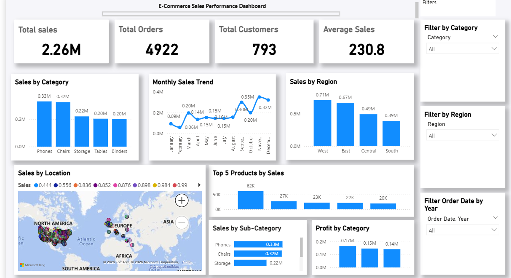
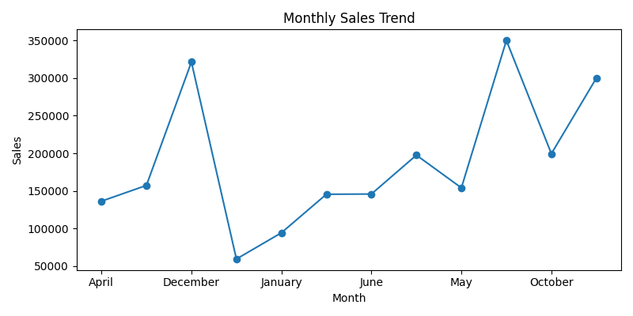
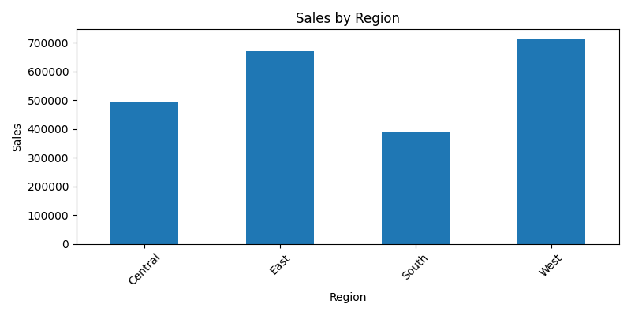
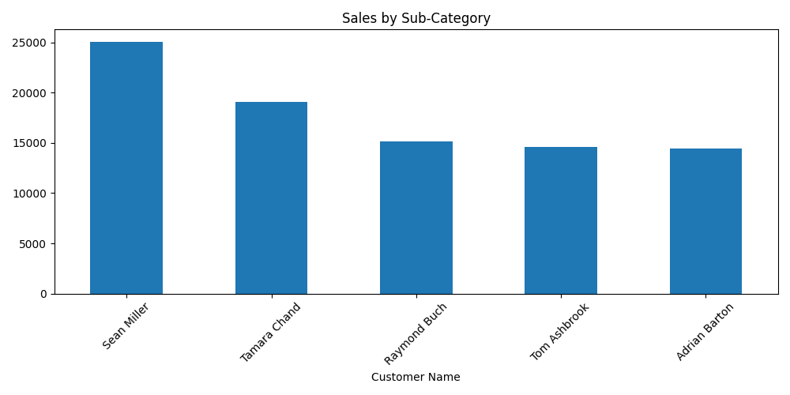
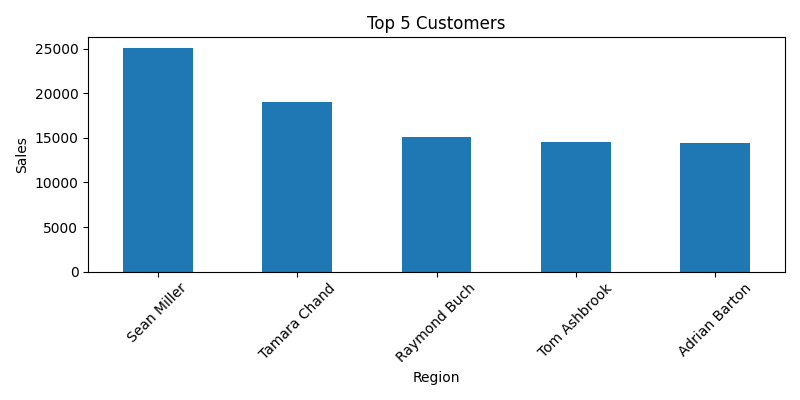

🛒 E-commerce Sales Analysis Project

📌 Introduction
This project analyzes E-commerce sales data to find useful business insights.
The analysis is done using Excel, SQL, Python, and Power BI.

🎯 Objective
Understand sales trends
Identify top customers
Analyze sales by region and category
Create interactive dashboard

🛠️ Tools Used
Excel
SQL
Python (Pandas, Matplotlib)
Power BI

📂 Project Structure
Ecommerce_Sales_Analysis/ │ ├── Data/ │ ├── Raw_Data.csv │ └── Clean_Data.csv │ ├── Excel_Work/ │ └── Book1.xlsx │ ├── PowerBI/ │ └── Ecommerce_Dashboard.pbix │ ├── Python/ │ ├── Analysis.ipynb │ └── Chart/ │ ├── monthly_sales.png │ ├── sales_by_region.png │ ├── sub-category.png │ ├── top_customers.png │ └── dashboard.png │ └── SQL/ └── Queries/ ├── Monthly_Sales_Trend.sql └── Rank.sql

📊 Key Insights
Sales increase observed in festive months
Top region contributes highest revenue
Few customers generate major sales
Some categories perform better

📊 Power BI Dashboard

This dashboard shows:

Sales trend
Sales by region
Top customers
Category performance

📊 Charts
  

  

  

 

▶️ How to Run
Open dataset in Excel / SQL
Run SQL queries
Open Python notebook
Open Power BI dashboard

💡 Conclusion
This project helps in understanding sales patterns and making data-driven decisions.
